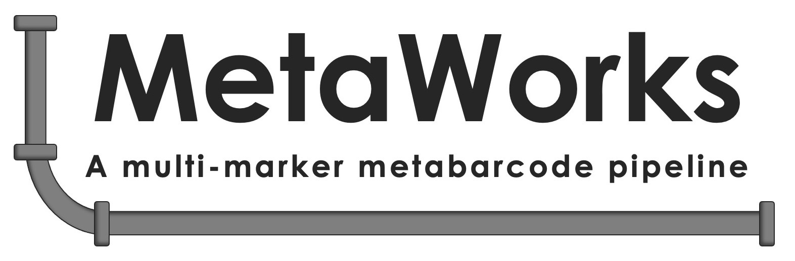

  

 

<h2> Why MetaWorks? </h2>

<h5 class="text-info">Free and open-source software</h5>

MetaWorks runs at the command-line on linux-64.  The pipeline strings together popular open-source free software tools to process demultiplexed Illumina paired-end reads such as SeqPrep (St. John, 2016), CutAdapt (Martin, 2011), VSEARCH (Rognes, Flouri, Nichols, Quince, & Mahé, 2016), and the RDP Classifier (Wang, Garrity, Tiedje, & Cole, 2007).

<h5 class="text-info">Versioned workflows to improve reproducibility</h5>

MetaWorks is versioned and available from <a href="https://github.com/terrimporter/MetaWorks">GitHub.</a>

<h5 class="text-info">Harmonized Conda processing environment</h5>

MetaWorks comes with a conda environment file that should be activated before running the pipeline. Conda is an open-source environment and package manager (Anaconda, 2016). The environment file contains most of the programs and dependencies needed to run MetaWorks. If pseudogene filtering will be used, then the NCBI ORFfinder program will also need to be installed.  Additional RDP-trained reference sets may need to be downloaded if the reference set needed is not already built in to the RDP classifier.
 

<h5 class="text-info">Uses Snakemake for scalable processing</h5>

Snakemake is a Python-based workflow manager (Koster and Rahmann, 2012) that strings together workflow-steps and distributes these jobs across a high performance computing platform to efficiently manage computational resources.  Interrupted jobs can be re-started following the last successful step.

<h5 class="text-info">Generates either exact sequence variants and/or operational taxonomic units</h5>

MetaWorks offers workflows for generating exact sequence variants (zero-radius OTUS) and/or operational taxonomic units using a 97% identity cutoff using VSEARCH.
 

<h5 class="text-info">Supports popular metabarcode markers</h5>

MetaWorks was specifically developed to handle different types of metabarcodes from ribosomal RNA genes + spacers to protein coding genes.  Unique marker considerations, such as the removal of conserved rRNA genes from ITS sequences and putative pseudogenes from COI is supported.  Our integrated pseudogene-filtering approaches can be used when processing protein-coding metabarcodes has been <a href="https://link.springer.com/article/10.1186/s12859-021-04180-x">published.</a>

<h5 class="text-info">Developed to support projects that cut across taxon lines!</h5>  

Our pipelines have been around, in one form or another, since before the terms metabarcoding and eDNA were coined.  As we know, ‘best practice’ is a moving target in this field.  MetaWorks is based on ‘best practices’ from the fields of microbial and fungal molecular ecology and strives to accommodate the needs of the animal metabarcode community.  We are driven by the need to make metabarcode bioinformatic processing both scalable and tractable within reasonable timeframes.  This pipeline is in active development to keep up with improvements in the underlying programs and reference sequence databases.
 

MetaWorks has been used as a part of the <a href="https://stream-dna.com/">STREAM</a> and <a href="https://www.canada.ca/en/environment-climate-change/services/biodiversity/ecobiomics.html">EcoBiomics</a> projects to process multi-marker metabarcode datasets from freshwater benthos, water, and soil.
 

<h2>Citing Metaworks</h2>

If you use this dataflow or any of the provided scripts, please cite the MetaWorks preprint:
 

Porter, T.M., Hajibabaei, M. 2020. METAWORKS: A flexible, scalable bioinformatic pipeline for multi-marker biodiversity assessments. BioRxiv, doi: https://doi.org/10.1101/2020.07.14.202960.

If you use the pseudogene filtering methods, please cite the pseudogene publication:
 

Porter, T.M., & Hajibabaei, M. (2021). Profile hidden Markov model sequence analysis can help remove putative pseudogenes from DNA barcoding and metabarcoding datasets. BMC Bioinformatics, 22: 256.

