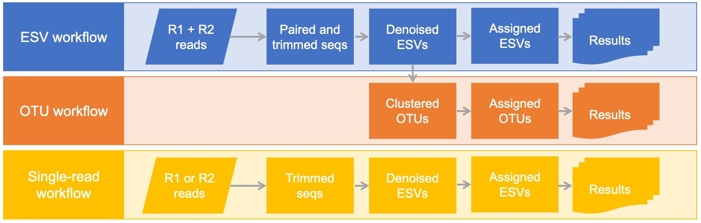
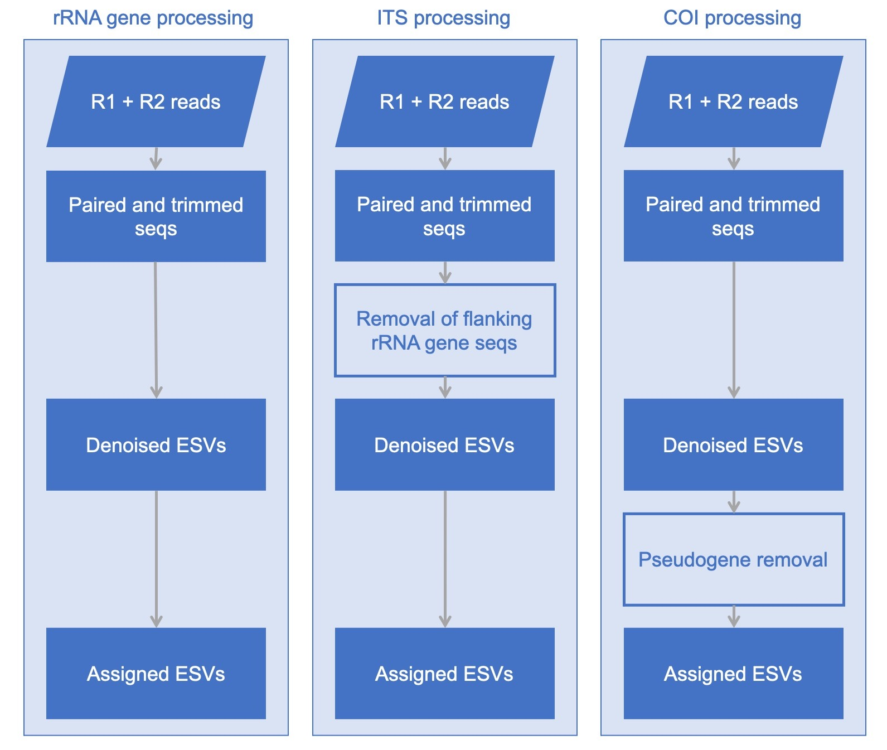

  

 

<h2> Why MetaWorks? </h2>

<h5 class="text-info">Free and open-source software</h5>

MetaWorks runs at the command-line on linux-64. The pipeline strings together popular open-source free software tools to process demultiplexed Illumina paired-end reads such as SeqPrep (St. John, 2016), CutAdapt (Martin, 2011), VSEARCH (Rognes, Flouri, Nichols, Quince, & Mahé, 2016), and the RDP Classifier (Wang, Garrity, Tiedje, & Cole, 2007).

<h5 class="text-info">Versioned workflows to improve reproducibility</h5>

MetaWorks is versioned and available from <a href="https://github.com/terrimporter/MetaWorks" target="_blank">GitHub.</a>

<h5 class="text-info">Harmonized Conda processing environment</h5>

MetaWorks comes with a conda environment file that should be activated before running the pipeline. Conda is an open-source environment and package manager (Anaconda, 2016). The environment file contains most of the programs and dependencies needed to run MetaWorks. If pseudogene filtering will be used, then the NCBI ORFfinder program will also need to be installed. Additional RDP-trained reference sets may need to be downloaded if the reference set needed is not already built in to the RDP classifier.
 

<h5 class="text-info">Uses Snakemake for scalable processing</h5>

Snakemake is a Python-based workflow manager (Koster and Rahmann, 2012) that strings together workflow-steps and distributes these jobs across a high performance computing platform to efficiently manage computational resources. Interrupted jobs can be re-started following the last successful step.

<h5 class="text-info">Generates either exact sequence variants and/or operational taxonomic units</h5>

MetaWorks offers workflows for generating exact sequence variants (ESVs) and/or operational taxonomic units (OTUs) using a 97% identity cutoff using VSEARCH. A workflow is also available for single-read processing for when the amplicon reads do not overlap.

  

<h5 class="text-info">Supports popular metabarcode markers</h5>

MetaWorks was specifically developed to handle different types of metabarcodes from ribosomal RNA genes + spacers to protein coding genes. Unique marker considerations, such as the removal of conserved rRNA genes from ITS sequences and putative pseudogenes from COI is supported. A detailed description of our pseudogene-filtering approaches for protein-coding metabarcode markers has been <a href="https://link.springer.com/article/10.1186/s12859-021-04180-x" target="_blank">published</a>.

  

MetaWorks uses a naive Bayesian classifier to make taxonomic assignments with a measure of confidence (Wang et al, 2007). Built-in markers include the popular prokaryote 16S rRNA gene, fungal ITS, and fungal LSU rRNA markers. Custom-trained classifiers developed for MetaWorks includes: COI, 18S rRNA, rbcL, and 12S.

<h5><a id="classifier_table"><strong>Trained classifiers are available for a variety of popular metabarcoding targets</strong></a></h5>

<table class="table table-hover">
  <thead>
    <tr>
      <th scope="col">Marker</th>
      <th scope="col">Target taxa</th>
      <th scope="col">Classifier availability</th>
    </tr>
  </thead>
  <tbody>
    <tr class="table-default">
      <td>COI</td>
      <td>Eukaryotes</td>
      <td><a href="https://github.com/terrimporter/CO1Classifier" target="_blank">https://github.com/terrimporter/CO1Classifier</a></td>
    </tr>
	<tr class="table-default">
      <td>rbcL</td>
      <td>Diatoms</td>
      <td><a href="https://github.com/terrimporter/rbcLdiatomClassifier" target="_blank">https://github.com/terrimporter/rbcLdiatomClassifier</a></td>
    </tr>
	<tr class="table-default">
      <td>rbcL</td>
      <td>Eukaryotes</td>
      <td><a href="https://github.com/terrimporter/rbcLClassifier" target="_blank">https://github.com/terrimporter/rbcLClassifier</a></td>
    </tr>
	<tr class="table-default">
      <td>12S</td>
      <td>Fish</td>
      <td><a href="https://github.com/terrimporter/12SfishClassifier" target="_blank">https://github.com/terrimporter/12SfishClassifier</a></td>
    </tr>
	<tr class="table-default">
      <td>12S</td>
      <td>Vertebrates</td>
      <td><a href="https://github.com/terrimporter/12SvertebrateClassifier" target="_blank">https://github.com/terrimporter/12SvertebrateClassifier</a></td>
    </tr>
	<tr class="table-default">
      <td>SSU (18S)</td>
      <td>Diatoms</td>
      <td><a href="https://github.com/terrimporter/SSUdiatomClassifier" target="_blank">https://github.com/terrimporter/SSUdiatomClassifier</a></td>
    </tr>
	<tr class="table-default">
      <td>SSU (16S)</td>
      <td>Vertebrates</td>
      <td><a href="https://github.com/terrimporter/16SvertebrateClassifier" target="_blank">https://github.com/terrimporter/16SvertebrateClassifier</a></td>
    </tr>
	<tr class="table-default">
      <td>SSU (18S)</td>
      <td>Eukaryotes</td>
      <td><a href="https://github.com/terrimporter/18SClassifier" target="_blank">https://github.com/terrimporter/18SClassifier</a></td>
    </tr>
	<tr class="table-default">
      <td>SSU (16S)</td>
      <td>Prokaryotes</td>
      <td>Built-in to the RDP classifier</td>
    </tr>
	<tr class="table-default">
      <td>ITS</td>
      <td>Fungi (Warcup)</td>
      <td>Built-in to the RDP classifier</td>
    </tr>
	<tr class="table-default">
      <td>ITS</td>
      <td>Fungi (UNIE 2014)</td>
      <td>Built-in to the RDP classifier</td>
    </tr>
	<tr class="table-default">
      <td>ITS</td>
      <td>Fungi (UNIE 2021)</td>
      <td><a href="https://github.com/terrimporter/UNITE_ITSClassifier" target="_blank">https://github.com/terrimporter/UNITE_ITSClassifier</a></td>
    </tr>
	<tr class="table-default">
      <td>ITS</td>
      <td>Plants (PLANiTS)</td>
      <td><a href="https://github.com/terrimporter/PLANiTS_ITSClassifier" target="_blank">https://github.com/terrimporter/PLANiTS_ITSClassifier</a></td>
    </tr>
	<tr class="table-default">
      <td>LSU</td>
      <td>Fungi</td>
      <td>Built-in to the RDP classifier</td>
    </tr>
  </tbody>
</table>

<h5 class="text-info">Developed to support projects that cut across taxon lines!</h5>  

Our pipelines have been around, in one form or another, since before the terms metabarcoding and eDNA were coined. As we know, ‘best practice’ is a moving target in this field. MetaWorks is based on ‘best practices’ from the fields of microbial and fungal molecular ecology and strives to accommodate the needs of the animal metabarcode community. We are driven by the need to make metabarcode bioinformatic processing both scalable and tractable within reasonable timeframes. This pipeline is in active development to keep up with improvements in the underlying programs and reference sequence databases.
 

MetaWorks has been used as a part of the <a href="https://stream-dna.com/" target="_blank">STREAM</a> and <a href="https://www.canada.ca/en/environment-climate-change/services/biodiversity/ecobiomics.html" target="_blank">EcoBiomics</a> projects to process multi-marker metabarcode datasets from freshwater benthos, water, and soil.
 

<h2>Papers and Projects That Use MetaWorks</h2>

Edge TA, Baird DJ, Bilodeau G, Gagné N, Greer C, Konkin D, et al. 2020.  <a href="https://doi.org/10.1016/j.scitotenv.2019.135906" target="_blank">The Ecobiomics project: Advancing metagenomics assessment of soil health and freshwater quality in Canada</a>. Science of The Total Environment, 710: 135906. doi:10.1016/j.scitotenv.2019.135906

Moir, C. 2021. <a href="https://hdl.handle.net/10214/25791" target="_blank">No Stomach, No Problem: an Integrated Morpho-Molecular Approach to Assessing the Diets of the Cunner Wrasse, Tautogolabrus adspersus, among Coastal, Nearshore Regions of Atlantic Canada</a> (Doctoral dissertation, University of Guelph).

Porter, TM & Hajibabaei, M, 2020. <a href="https://doi.org/10.1101/2020.07.14.202960" target="_blank">METAWORKS: A flexible, scalable bioinformatic pipeline for multi-marker biodiversity assessments</a>. bioRxiv, doi:10.1101/2020.07.14.202960

Porter, TM, & Hajibabaei, M. (2021). <a href="https://doi.org/10.1186/s12859-021-04180-x" target="_blank">Profile hidden Markov model sequence analysis can help remove putative pseudogenes from DNA barcoding and metabarcoding datasets</a>. BMC Bioinformatics, 22(1): 256. doi:10.1186/s12859-021-04180-x

Robinson, CV, Baird, DJ, Wright, MTG, Porter, TM, Hartwig, K, Hendriks, E, Maclean, L, Mallinson, R, Monk, WA, Paquette, C and Hajibabaei, M. 2021. <a href="https://doi.org/10.1016/j.pecon.2021.03.001" target="blank">Combining DNA and people power for healthy rivers: Implementing the STREAM community-based approach for global freshwater monitoring. Perspectives in Ecology and Conservation</a>, 19(3): 279-285. doi:10.1016/j.pecon.2021.03.001

Robinson, CV, Porter, TM, Maitland, VC, Wright, MT and Hajibabaei, M. 2021. <a href="https://doi.org/10.1101/2021.11.14.468533" target="blank">Multi-marker metabarcoding resolves subtle variations in freshwater condition: Bioindicators, ecological traits, and trophic interactions</a>. bioRxiv, doi:10.1101/2021.11.14.468533

Rudar, J, Golding, GB, Kremer, SC and Hajibabaei, M. 2022. <a href="https://doi.org/10.1101/2022.03.31.486647" target="blank">Decision Tree Ensembles Utilizing Multivariate Splits Are Effective at Investigating Beta-Diversity in Medically Relevant 16S Amplicon Sequencing Data.</a> bioRxiv, doi:10.1101/2022.03.31.486647

Smenderovac E, Emilson C, Porter T, Morris D, Hazlett P, Diochon A, et al. 2022.  <a href="https://doi.org/10.1038/s41598-022-07670-x" target="_blank">Forest soil biotic communities show few responses to wood ash applications at multiple sites across Canada.</a> Sci Rep., 12: 4171. doi:10.1038/s41598-022-07670-x

<h2>How to Cite</h2>

If you use this dataflow or any of the provided scripts, please cite the MetaWorks preprint:
 

Porter, T.M., Hajibabaei, M. 2020. <a href="https://doi.org/10.1101/2020.07.14.202960" target="_blank">METAWORKS: A flexible, scalable bioinformatic pipeline for multi-marker biodiversity assessments</a>. bioRxiv, doi:10.1101/2020.07.14.202960

You can also cite the MetaWorks repository:

Teresita M. Porter. (2020, June 25). <a href="http://doi.org/10.5281/zenodo.4741407" target="_blank">MetaWorks: A Multi-Marker Metabarcode Pipeline (Version v1.10.0)</a>. Zenodo, doi:10.5281/zenodo.4741407

If you use this dataflow for making COI taxonomic assignments, please cite the COI classifier publication:

Porter, T. M., & Hajibabaei, M. (2018). <a href="https://doi.org/10.1038/s41598-018-22505-4" target="_blank">Automated high throughput animal CO1 metabarcode classification</a>. Scientific Reports, 8, 4226. doi:10.1038/s41598-018-22505-4

If you use the pseudogene filtering methods, please cite this publication::
 

Porter, T.M., & Hajibabaei, M. (2021). <a href="https://doi.org/10.1186/s12859-021-04180-x" target="_blank">Profile hidden Markov model sequence analysis can help remove putative pseudogenes from DNA barcoding and metabarcoding datasets</a>. BMC Bioinformatics, 22: 256. doi:10.1186/s12859-021-04180-x

If you use the RDP classifier, please cite the publication:

Wang, Q., Garrity, G. M., Tiedje, J. M., & Cole, J. R. (2007). <a href="https://doi.org/10.1128/AEM.00062-07" target="_blank">Naive Bayesian Classifier for Rapid Assignment of rRNA Sequences into the New Bacterial Taxonomy. Applied and Environmental Microbiology</a>. 73(16), 5261–5267. doi:10.1128/AEM.00062-07

